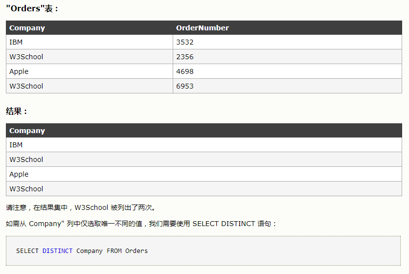
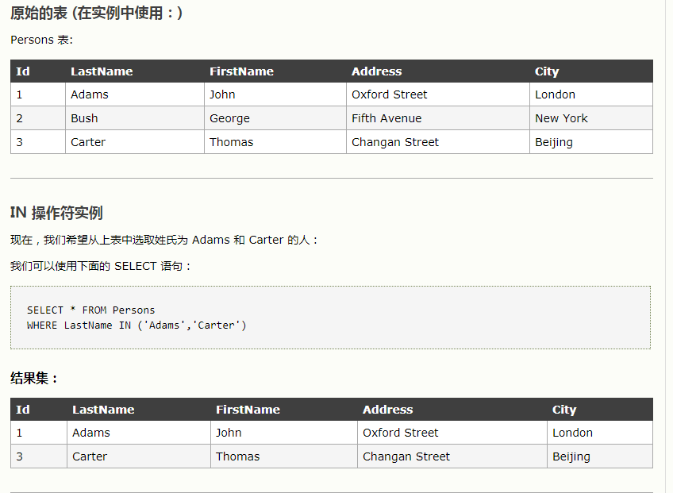
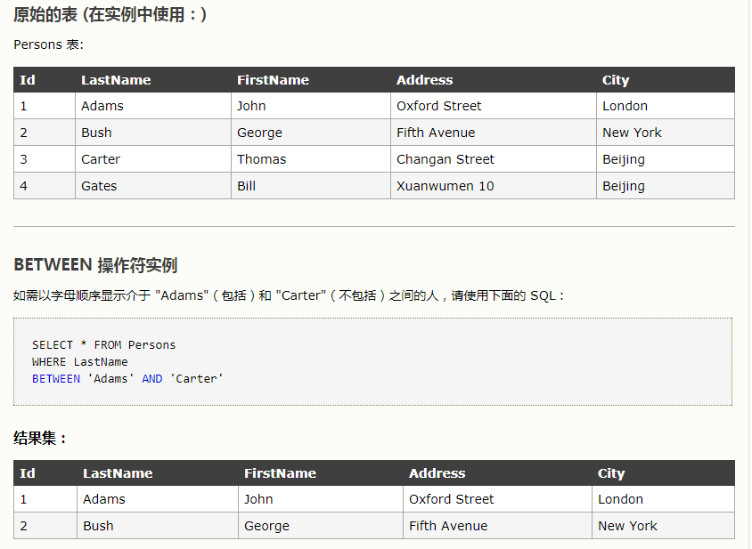

### 一些基本知识
* SELECT * FROM TABLE1 LEFT JOIN TABLE2 ON ...
*  left join on是查询左边所有右边满足条件的记录如下所示语法
```sql
SELECT p.FirstName, p.LastName, a.City, a.State  FROM Person p LEFT JOIN Address a on p.PersonId = a.PersonId;
```
* RIGHT JOIN ON 与其对应 查询的是右边所有，左边满足条件的记录，比如上述查询等效如下：
```sql
SELECT p.FirstName, p.LastName, a.City, a.State  FROM  Address a RIGHT JOIN  Person p on p.PersonId = a.PersonId;
```
* DISTINCT 是去除查询的结果集中重复的元素
```sql
SELECT DISTINCT salary FROM TABLE
```

* IN操作符如下用法

其中要是查找不在其中的就是加个NOT IN 这样就可以找到补集
* between语句

### join
* inner join是内连接，关键字在表中存在至少一个匹配时返回行，没有匹配就不返回
* left join和right join肯定有返回,left join是左边所有加上右边满足条件的，right join是右边所有加上左边满足条件的 
* UNION 语句是将两个查询的结果合并，这个会去除重复的元素
* union all 回列出所有元素
```sql
SELECT NAME FROM C
UNION ALL
SELECT NAME FROM B
```
* group by是按类分的最后返回的感觉是两个表的样子
* 分享一个细节就是使用IN的语句时，可以 in table，不过列需要对应
```sql
SELECT * from t_topics WHERE (reply_count,user_id) IN (SELECT user_id as id,max(reply_count) as max from t_topics GROUP BY user_id)
```
比如这个，in前面的列顺序必须和后面的一致
