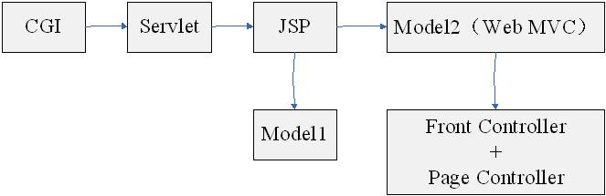
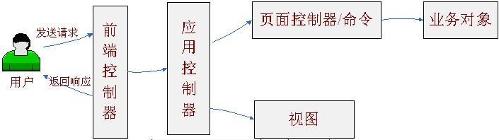
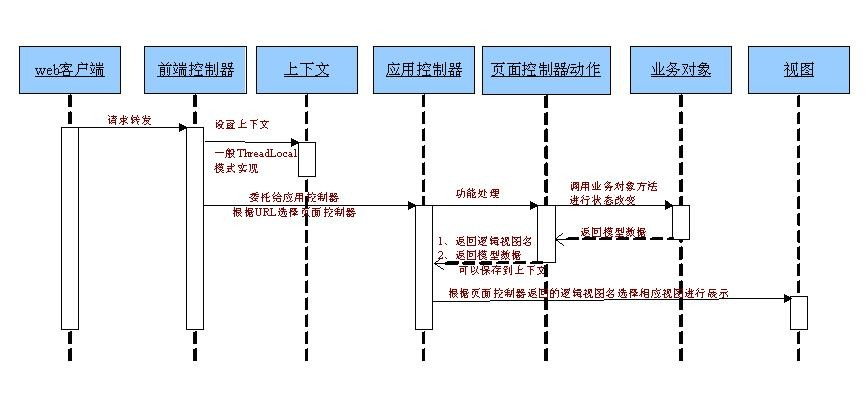
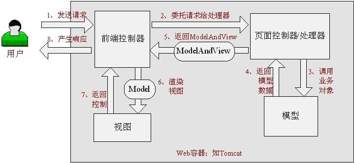
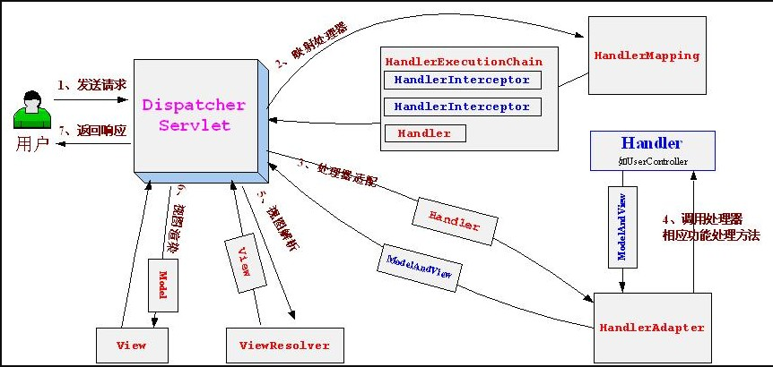

#### web端的发展历程
如下图所示

* 最早的CGI 公共网关接口，一种在web服务端使用的脚本技术，使用C或Perl语言编写，用于接收web用户请求并处理，最后动态产生响应给用户，但每次请求将产生一个进程，重量级。
* servlet 一种JavaEE web组件技术，是一种在服务端执行的web组件，用于接收用户请求，最后动态产生响应给用户，每次请求就是新建一个线程，这个比CGI要轻量级，能够使用JavaEE 技术,比如JDBC，本质就是在Java代码里面输出HTML流，但是表现逻辑、业务逻辑、控制逻辑混杂。直接在Java代码里面输出HTML，非常不方便。
* JSP 本质还是servlet，就是在HTML中动态写入Java代码.
* Model1 就是jsp升级版，之前请求参数都是通过servlet api获得的，model1中可以在jsp中使用标签<jsp:usebean>将请求参数封装到对象中直接使用，但是jsp中加入了控制，业务，混杂。
* Model2 实现了分层，但是请求参数没有封装到Javabean中，还需要手动封装，而且视图的转发严重依赖 servlet api比如请求的转发。
* 后来的struts2就是使用了拦截器对请求参数进行封装到bean中，也就是vo中，而且视图的控制由xml进行，视图就是jsp。
* 现在的web mvc模式框架，比如spring MVC框架

> 服务到工作者模式：前端控制器（front controller） 应用控制器（application controller）页面控制器也称为动作（page controller）上下文（context）现在springMVC框架使用的就是这个模式。

这个模式如下图所示,这是最一般的模式：

* `前端控制器`  负责为表现层提供统一访问节点，避免model2中出现的重复的控制逻辑，比如前端控制器统一回调相应的功能方法，比如委托应用控制器选择功能处理模块和视图，在model2中都是自己编写的。
* `应用控制器` 根据url选择处理器，选择返回的视图，策略设计模式
* `页面控制器` 功能处理代码，收集参数，封装参数到模型，转调业务对象处理模型，返回逻辑视图名给前端控制器，前端控制器委托应用控制器选择具体的视图，命令模式。
* `上下文` model2中为视图准备要展示的模型数据，我们直接放到了request中，有了上下文之后，我们可以将相关数据放到上下文中，从而和协议无关，也就是和servlet api无关，一般是通过threadlocal实现，线程独享的数据放到threadlocal中是一个键值对。

> 轻薄的web表现层，做的事情越少越好，薄薄的，不应该包含无关的代码，只负责收集并组织参数到模型对象，启动业务对象的调用，控制器只返回逻辑视图名并由响应的应用控制器来选择具体。

#### SpringMVC
> SpringMVC是一个基于Java实现了web mvc设计模式的请求驱动类型的轻量级web框架，请求驱动指的是使用请求-响应模型。
Spring web mvc也是服务到工作者模式的实现，

前端控制器：dispatcherServlet就是给web表现层提供统一的访问节点，委托应用控制器进行URL映射和视图选择。

SpringMVC将应用控制器拆为处理映射器（handler mapping）和视图解析器（view resolver）。

页面控制器是controller接口（这个一般是使用注解进行和URL对应，包含modelAndView request response）支持本地化解析，主题解析文件上传，还有就是数据验证，数据格式化和数据绑定机制。提供了强中的约定大于配置的契约式编程支持。

SpringMVC模式一个请求的完整过程如下图所示：

具体执行步骤如下：

1. 首先用户发送请求————>前端控制器，前端控制器根据请求信息（如URL）来决定选择哪一个页面控制器进行处理并把请求委托给它，即以前的控制器的控制逻辑部分；
2. 页面控制器接收到请求后，进行功能处理，首先需要收集和绑定请求参数到一个对象，这个对象在Spring Web MVC中叫命令对象，并进行验证，然后将命令对象委托给业务对象进行处理；处理完毕后返回一个ModelAndView（模型数据和逻辑视图名）；
3. 前端控制器收回控制权，然后根据返回的逻辑视图名，选择相应的视图进行渲染，并把模型数据传入以便视图渲染；
4.  前端控制器再次收回控制权，将响应返回给用户;

其实前端控制器主要是协调的作用，spring web mvc的集中访问点，主要职责就是调度工作，本身主要用于流程控制。

#### springMVC容器和spring之间的关系

平时并没有很注意这方面的东西，在配置的时候只会

#### rpc和restFUL api

HTTP是一种应用层网络协议，RPC可以采用自定义协议，也可以通过HTTP协议来传输，thrift，grpc，xml-rpc，json-rpc都是通过HTTP传输的。HTTP既支持长连接，也支持短连接。
rpc使用的则是长连接，不需要频繁的建立连接，RESTFUL API使用的是短连接，效率低下，而且在数据传输上，restful api传输了很多无用信息，比如那些header，对于rpc来说却没有。

所以为什么要用rpc调用？

因为良好的rpc调用是面向服务的封装，针对服务的可用性和效率等都做了优化。单纯使用http调用则缺少了这些特性。

简单来说成熟的rpc库相对http容器，跟多的是封装了“服务发现”，"错误重试"一类面向服务的高级特性。可以这么理解，rpc框架是面向服务的更高级的封装。如果把一个http server容器上封装一层服务发现和函数代理调用，那它就已经可以做一个rpc框架了。

1. 性能，不出很大的意外，http服务都是百毫秒级的，而thrift则能轻松搞到几十ms，别小看这点时间，这少一点，用户的痛苦就会小很多。。。，那么为什么性能差？http需要dns，这来回的网络消耗不是盖的，对于MT的服务是完全没有必要的开销；
2. 扩展性，http的服务发现纯粹是靠dns做的，加机器需要配置一下dns，这要惊动运维，还有等漫长的roll out时间，与基于zookeeper的自动发现的thrift比，毫无优势可言；
3. 管理麻烦，http配置的域名需要管理起来也是麻烦事，对外提供统一服务，内部也需要统一一下域名的命名
4. RPC:远程过程调用。RPC的核心并不在于使用什么协议。RPC的目的是让你在本地调用远程的方法，而对你来说这个调用是透明的，你并不知道这个调用的方法是部署哪里。通过RPC能解耦服务，这才是使用RPC的真正目的。RPC的原理主要用到了动态代理模式，至于http协议，只是传输协议而已。

