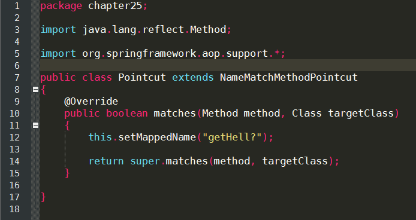
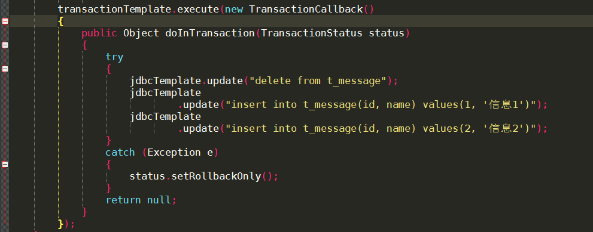
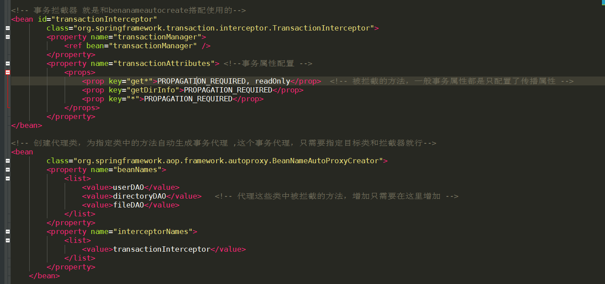

### spring的特点
* 非入侵框架，应用程序对框架依赖更小
* 提供了一种在任何环境下都可以使用的编程模型，代码和环境分离
* 提高代码重用性

### 反向控制和依赖注入
* spring剥夺了调用者创建被调用者的权利，这叫反向控制，也叫依赖注入，这些都是在xml中进行实例化，调用者再通过xml引入，这样调用者和被调用者之间的耦合度就降低了。
* 反向控制的具体实现就是在xml中实例化，然后引入该xml
* 方向控制的核心思想就是建立对象的过程在对象工厂外面进行，对象工厂通过多态的方式来建立相应对象
* 调用者依赖spring IOC容器来获得（注入）对象实例
* 这里面有点设计模式的感觉，就是类之间的直接引用导致代码耦合度过高，不便于维护和拓展，这里就应该降低耦合度，所以需要在外部创建另一个类的实例，另一个类再引用就行了。
* spring默认实例化bean的时候是单例模式，**scope属性**可以更改
* spring加入构造函数的参数时，所有参数默认都是string类型进行查找
* 还可以通过autowire进行自动装配，这个是通过类型名字等装配属性或者构造函数的参数
#### spring装配时的属性编辑器
* 属性编辑器就是使用一些基本类型的数据来装配其它类型的属性，比如URL url，本来url属性是个对象，但是实际使用的时候可以直接使用string类型来装配，这就是属性编辑器的功能。
* 属性编辑器需要继承那个类然后覆盖响应的方法，最后在xml中进行装配该属性编辑器。
***
### 面向切面编程AOP
* 传统的OOP不能做到随时在某个类中加入某个功能实现
* 即使加上了，后期维护拓展也很难
* AOP就是往这些类中加入一些实现，而这些实现不是在类中，而是在aspect中，这样就使得这些实现很容易维护。
* spring有自己的AOP框架，还可以使用其他的比如 AspectJ Jboss AOP
* Spring的事务管理就是用的这个，就是在指定方法中进行事务的代理，将改方法放到事务中处理，也就是在指定的方法中加入了事务的实现。
#### 面向切面编程一些基本特点
* 方面（aspect）相当于OOP中的类，封装用于横插入系统的功能。
* 通知（advice）就是方面中的方法，要插入的功能实现在这里写
* 连接点（joinpoint）应用程序插入方面的地点，就是指定哪些类。
* 切入点（pointcut）这个就是指定连接点中的方法
* 目标（target）AOP的目标，要拦截的靶子
* 代理（proxy）也是一个类，相当于目标类的子类，通过这个子类来访问目标类
* 织入（weaving）在目标对象中插入方面代码的过程叫做织入
***
#### 前置通知（beforeadvice）
* 顾名思义，就是在目标方法之前完成的
* 这里就是拦截了指定接口中的所有方法，然后在advice中可以获取该方法，方法的参数，以及该方法所在类。
* 前置通知还可以改变拦截方法的参数
***
#### 后置通知（afteradvice）
* 后置通知和前置通知原理是一样的，只不过他是在目标方法完成之后执行的
***
#### 环绕通知（aroundadvice）
* 环绕通知有点不同的是它可以阻止目标方法的执行（这里可以使一些调试的方法在发布之后不执行，不删除，方便下次调试，发布时还不影响）
* 环绕通知还可以控制目标方法的返回值

***
#### 异常通知（throws advice）
* 异常通知就是在异常发生时执行
* 该异常通知处理完之后，异常仍然抛出，若想捕获还需要使用try catch进行异常的捕获。
***
### 使用advisor指定切入点（就是指定拦截哪些方法）
* 前面那些是拦截了目标接口中的所有方法，这个就不能容忍，降低系统效率。
*  这个配置是有点麻烦的，下面是一个实例




目标接口中的方法被调用之前会先调用这个match方法判断是否是指定的方法。
***
### 使用控制流切入点，这个是可以拦截某种情况下调用的方法，比如只拦截在某个类中调用的该方法
* 这个是动态切入点最好不要使用

***
### spring的事务管理
* spring把事务委托给第三方管理，transactionManager类中配置事务
* 通常是通过事务模板来操作数据库
* 这里分为编程式事务和声明式事务
##### 编程式事务
* 编程式事务就是执行execut方法时回调一个方法，该方法会放在事务中执行
* 编程式事务不方便



#### 声明式事务
 
* 这个是最常用的事务管理方式，可以配置事务属性
* 不需要编程，只是在xml中进行配置，有点AOP的感觉，拦截了指定接口中的方法，并在该方法中加入事务
* 这个hibernate事务中经常用到，不过hibernate中用到的是BeanNameAutoProxyCreator，这个类中指定拦截的类，然后再在interceptorNames属性指定拦截器
* 拦截器中指定拦截的方法及事务属性，这样就能自动为指定的方法产生事务代理
* hibernate4之后不能使用事务模板了，所以直接使用hibernate原生的方法操作数据库，也就是使用session，xml配置sessionfactory，还有就是配置hibernate DataSource时不能使用hibernate生成的那个xml了，只能在spring自己的xml中配置。


下面是具体的配置




> spring是一个轻量级开发应用框架，一个完整的应用是由一组相互协作的对象组成，spring就是是的这些对象在完成功能的同时实现低耦合，高内聚。spring一部分功能就是管理这些对象，处理对象间的依赖关系。spring还提供像通用日志记录、性能统计、安全控制、异常处理等面向切面的能力，还有数据库事物。超级粘合平台，除了自己提供功能外，还提供粘合其它技术和框架的能力。

spring的优点
1. 非常轻量级的容器，主要是Ioc和DI，集中管理对象和对象间依赖关系，实现低耦合。而且spring容器是非入侵式的（不需要依赖spring的类），spring不依赖环境，可以部署到很多环境。
2. AOP，面向切面编程，实现代码的复用，就是将一些通用功能提取出来，然后将这些通用功能在合适的时候织入到应用程序中。
3. 简单数据库事物管理，其实用到的也是AOP的功能。

spring的整体结构如下

### IOC/DI
控制反转，传统方式是一个类需要其它对象，是直接使用new实例化一个，但是这种导致对象间耦合度过高，现在对象的创建交给ioc容器了，由ioc容器控制对象的创建并获得需要改对象的地方，将容器中的实例化对象注入进去。这个体现了OOP设计法则之一，好莱坞法则，别找我们，我们找你。IOC通过反射的技术来实例化对象。


依赖注入 bean依赖IOC容器，IOC容器注入bean依赖资源。

spring的延迟初始化bean(创建容器时，提前初始化singleto作用域的bean)，这个就是指不提前初始化bean，而是只有在真正使用时才创建和初始化bean
```java
<bean id="helloApi"  
class="cn.javass.spring.chapter2.helloworld.HelloImpl"  
lazy-init="true"/>  
```
### Resource
 Spring的Resource接口代表底层外部资源，提供了对底层外部资源的一致性访问接口。比如常见的加载类路径下的资源文件，还可以使用路径通配符，?匹配一个字符串，* 匹配零个或多个字符串，
 **匹配路径中的零个或多个目录。
 
 ### AOP
 > OOP最大问题就是无法解耦组件进行开发，AOP为开发者提供一种进行横切关注点分离并织入的机制，把横切关注点分离，然后通过某种技术织入到系统中，从而解耦。
 
 #### 基本概念
 * 连接点（joinpoint）：表示在程序中插入横切关注点的拓展点，连接点可能是类初始化、方法执行、方法调用、字段调用或处理异常，spring只支持方法执行连接点，在AOP中表示在哪里干。
 * 切入点（Pointcut）：连接点集合，支持正则表达式定义切入点。
 * 通知（advice）：在连接点上执行的行为，这个就是具体实现，在连接点需要插入的行为。
 * 方面/切面（Aspect）：横切关注点的模块化，可以认为是通知、引入和切入点的组合。
 * 引入（inter-type declaretion）：也称为内部类型声明，为已有的类添加额外新的字段或方法，spring允许引入新的接口道所有被代理对象。
 * 目标对象（target object）：这个就是切入点选择的对象，也是代理对象。
 * 织入（weaving）：织入是一个过程，是将切面应用到目标对象从而创建出AOP代理对象的过程。

下面是具体xml配置，首先指定切入点，然后定义切面，切面里面包括切入点和通知。
```xml
    <aop:config>
        <aop:pointcut id="point" expression="execution(* com.xq..*.*(..))"/>
        <aop:aspect ref="aspect">
            <aop:before method="beforeAdvice" pointcut-ref="point"/>
            <aop:after method="afterFinallyAdvice" pointcut-ref="point"/>
        </aop:aspect>
    </aop:config>
```

下面是在spring配置文件中aop的详细配置


说一下引用，引用就是直接给加方法，使得目标对象实现了某个接口，具有某个方法。
```xml
    <aop:config>
        <aop:pointcut id="point" expression="execution(* com.xq..*.*(..))"/>
        <aop:aspect ref="aspect">
            <aop:before method="beforeAdvice" pointcut-ref="point"/>
            <aop:after method="afterFinallyAdvice" pointcut-ref="point"/>
            <aop:declare-parents types-matching="com.xq..*.IHelloWorldService+" implement-interface="com.xq.aop.IntroducService" default-impl="com.xq.aop.impl.IntroducServiceImpl"/>
        </aop:aspect>
    </aop:config>
```

advisor 就是只有一个通知和一个切入点的切面，然后切入点的话还是按之前的方式设置，通知类就必须实现相应的接口（入侵式），这比普通的aspect要麻烦的多。

还有一种使用注解的方式，不过这种方式感觉好麻烦，不建议使用，如果使用的话就是在xml配置文件中使用 <aop:aspectj-autoproxy/>就能使用注解的方式了。


#### 切入点表达式
1. execution（方法表达式）匹配方法执行
举几个例子，这个可以在项目中慢慢体会，没啥。

public * *(..)          任何公共方法执行
    * cn.javass..IPointcutService.*() cn.javass包及其子包下的IPointcutService接口中的任何无参方法。
2. within 匹配指定类型内的方法执行
within(cn.javass..*)   cn.javass包及子包下的任何方法执行
3. this（类型权限定名）匹配当前AOP代理对象类型的执行方法。
this(cn.javass.spring.chapter6.service.IPointcutService)    当前AOP对象实现了 IPointcutService接口的任何方法

AOP默认使用的是jdk的动态代理，这需要目标对象实现了某个接口，当目标对象没有实现接口的时候，就使用CGLIB代理来实现AOP。CGLIB不仅能进行接口代理也能进行类代理。
### spring的JDBC支持

> 虽然这个现在基本上不会直接使用JDBC操作了，但是还是要了解一下，spring简化了jdbc编程，主要提供三种方式，一种是JDBC模板、关系数据库对象化方式和simpleJdbc，后来的orm框架都不会使用这些了。JDBC模板对事务进行了处理，操作上更简单，封装了很多方法，

### ORM
> 对象关系映射，Java对象状态自动映射到关系数据库中的数据上，从而提供透明化的持久化支持。

当前ORM框架hibernate、JPA、mybatis、JDO等

* hibernate，全自动的ORM框架，能自动为对象生成相应的sql并透明化的持久化对象到数据库。通过SessionFactory获取session进行操作，必须自己控制事务，这很麻烦，所以spring还支持了hibernateTemplate模板来简化事务，这个和jdbc事务基本上差不多，由于是全自动化的，所以给程序猿的发挥空间就很少了，这是缺点
* mybatis是一个半自动化的orm框架，可以自己写sql。比hibernate要简单的多。
* JPA,也是一个ORM框架，spring也集成了这个。
### 数据库事务

数据库事物属性ACID
* 原子性：事务是不可分割的最小工作单元，事务内的操作要么全部成功，要么全部失败。
* 一致性：事务执行前数据库的数据处于正确的状态，事务执行后数据的数据还是处于正确状态。
* 隔离性：事务之间的隔离性，在一个事务内部的操作对其他事务不产生影响，这里面存在隔离级别。
* 持久性：事务一旦执行成功，它对数据的数据的改变必须是永久的。

多个事务并发执行带来的问题，解决的是事务之间并发访问一个数据库的问题。

* 脏读：一个事务看到了另一个事务未提交的更新数据
* 幻读：一个事务在执行过程中读取到了另一个事务已经提交的插入数据，即在第一个事务开始时读取到一批数据，但此后另一个事务又插入了新数据并提交，此时第一个事务又读取这批数据发现多了一条，好像发生幻觉一样。
* 丢失更新：两个事务同时更新一行数据，最后一个事务的更新会覆盖掉第一个事务的更新，没有加锁造成的。
* 不可重复读：在同一个事务中，多次读取同一数据返回不同结果，也就是有其他事务更改了这些数据。

解决并发问题，这就存在了数据库隔离级别

* 未提交读：最低隔离级别，并发的四个问题都有可能出现。
* 已提交读：可以避免丢死更新，脏读，可能能出现不可重复读，幻读，一个事务能读取到别的事务提交的更新数据，不能看到未提交的更新数据。
* 可重复读：保证同一事务先后执行的多次查询将返回同一结果，不受其他事务影响，不能避免幻读
* 可序列化：都能避免，不允许事务并发执行，必须串行执行。

隔离级别越高数据库事务并发执行性能越差，实际项目开发中一般使用已提交读，不可重复读和幻读靠乐观锁或悲观锁来解决这些问题。

数据库事务分为本地事务和分布式事务

Java事务类型有JDBC事务和JTA事务

### spring内置事务
1. jdbc及mybatis框架事务管理器DataSourceTrancationManager
2. hibernate事务
3. jpa事务
4. jdo事务
### spring的注解

依赖注入的装配
autowired根据类型，可以使用qualifier限定符限定名字，不过注册的时候也要使用这个限定符限定名字。
resource默认根据类型装配，也可以指定名字进行装配。
inject对应autowired
named是给bean加个名字

value是给加值
注册的注解
一般都使用component下的分层，这个没啥

